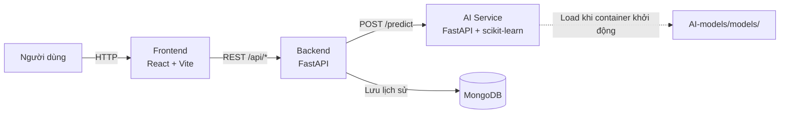
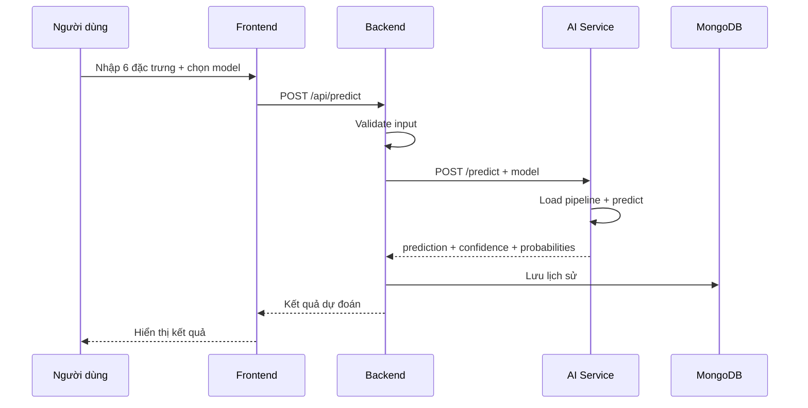

# Penguin Classification — Phân loại loài chim cánh cụt Palmer Archipelago

> Học phần **Học máy cơ bản** · Lớp **12523W.2** · GV: Nguyễn Đức Tuấn Anh · **Nhóm 14**

Ứng dụng web dự đoán loài chim cánh cụt (**Adelie / Chinstrap / Gentoo**) dựa trên 6 đặc trưng đo được.

Hệ thống sử dụng Logistic Regression làm model mặc định
cho chức năng dự đoán trong ứng dụng.

Các model Logistic Regression, KNN, SVM và Gradient Boosting được huấn luyện và đánh giá để so sánh trên tập test.
Giao diện cũng cung cấp bảng so sánh **Accuracy / Precision / Recall / F1** của các model trên tập test.

Toàn bộ hệ thống gồm **Frontend, Backend, AI Service và MongoDB**, được đóng gói bằng Docker và có thể khởi động bằng Docker Compose.

---

# 1. Thành viên

| Họ tên       | MSSV     | Phần việc                        |
| ------------ | -------- | -------------------------------- |
| Đặng Văn Sỹ  | 12523077 | `[EDA, xử lý dữ liệu, SVM, Gradient Boosting, Backend, AI Service]`|
| Đỗ Thanh Mai | 12523048 | `[Logistic Regression, KNN, Frontend, Docker, triển khai]` |

> Cả hai thành viên đều nắm được toàn bộ pipeline từ dữ liệu → tiền xử lý → huấn luyện → đánh giá → đóng gói model → AI Service → Backend → Frontend → Docker → triển khai và kiểm thử.

---

# 2. Bài toán

## 2.1. Mô tả

Bài toán sử dụng dữ liệu đo đạc chim cánh cụt tại quần đảo Palmer Archipelago để xây dựng mô hình Machine Learning dự đoán loài của một cá thể.

## 2.2. Loại bài toán

**Phân loại đa lớp (multiclass classification).**

Có 3 lớp mục tiêu:

* `Adelie`
* `Chinstrap`
* `Gentoo`

## 2.3. Cột mục tiêu

```text
species
```

## 2.4. Đầu vào

Hệ thống sử dụng 6 đặc trưng:

| Feature             | Kiểu dữ liệu | Ý nghĩa                  |
| ------------------- | ------------ | ------------------------ |
| `culmen_length_mm`  | float        | Chiều dài mỏ (mm)        |
| `culmen_depth_mm`   | float        | Độ sâu mỏ (mm)           |
| `flipper_length_mm` | int          | Chiều dài cánh chèo (mm) |
| `body_mass_g`       | int          | Khối lượng cơ thể (g)    |
| `island`            | categorical  | Đảo quan sát             |
| `sex`               | categorical  | Giới tính                |

## 2.5. Ý nghĩa thực tế

Mô hình hỗ trợ nhận diện nhanh loài chim cánh cụt dựa trên các số đo quan sát được, giảm sự phụ thuộc vào việc phân loại thủ công.

---

# 3. Dữ liệu

## 3.1. Nguồn dữ liệu

Dataset sử dụng:

**Palmer Archipelago (Antarctica) Penguin Data — Kaggle**

Nguồn dữ liệu:

https://www.kaggle.com/datasets/parulpandey/palmer-archipelago-antarctica-penguin-data

Dữ liệu gốc được thu thập bởi **Dr. Kristen Gorman và Palmer Station Antarctica LTER**.

**Giấy phép:** CC0.

## 3.2. Vị trí dữ liệu trong repository

```text
AI-models/
└── data/
    ├── archive.zip
    └── DATA.md
```

Dataset được lưu tại:

```text
AI-models/data/archive.zip
```

Notebook đọc dữ liệu từ file ZIP nên **không cần giải nén thủ công** để chạy pipeline hiện tại.

File:

```text
AI-models/data/DATA.md
```

chứa mô tả chi tiết các cột của dataset.

## 3.3. Các cột chính

| Cột                 | Kiểu   | Ý nghĩa                                      |
| ------------------- | ------ | -------------------------------------------- |
| `species`           | object | Loài chim cánh cụt — target                  |
| `island`            | object | Đảo quan sát: `Biscoe`, `Dream`, `Torgersen` |
| `culmen_length_mm`  | float  | Chiều dài mỏ                                 |
| `culmen_depth_mm`   | float  | Độ sâu mỏ                                    |
| `flipper_length_mm` | int    | Chiều dài cánh chèo                          |
| `body_mass_g`       | int    | Khối lượng cơ thể                            |
| `sex`               | object | `MALE` hoặc `FEMALE`                         |

## 3.4. Chia dữ liệu

Dữ liệu được chia:

```text
80% train
20% test
```

Sử dụng:

* `stratify` để giữ tỷ lệ các lớp;
* `random_state` cố định để kết quả có thể tái lập.

Khoảng:

```text
273 mẫu train
69 mẫu test
```

## 3.5. Tiền xử lý

Pipeline tiền xử lý được xây dựng bằng `sklearn Pipeline` và `ColumnTransformer`.

### Numeric features

* Điền giá trị thiếu bằng median.
* Chuẩn hóa bằng `StandardScaler`.

Các cột:

```text
culmen_length_mm
culmen_depth_mm
flipper_length_mm
body_mass_g
```

### Categorical features

* Điền giá trị thiếu bằng giá trị xuất hiện nhiều nhất.
* One-Hot Encoding.

Các cột:

```text
island
sex
```

Pipeline chỉ được `fit` trên tập train nhằm tránh **data leakage**.

## 3.6. EDA

Quá trình EDA gồm ít nhất 6 biểu đồ, bao gồm:

* Phân bố số lượng các loài.
* Phân bố các biến số.
* Bản đồ giá trị thiếu.
* Ma trận tương quan.
* Đặc trưng theo loài.
* Quan hệ giữa từng cặp biến số

Các hình EDA được lưu tại:

```text
docs/figure/
```

---

# 4. Kết quả model

Cả bốn model sử dụng:

* cùng dataset;
* cùng cách chia train/test;
* cùng pipeline tiền xử lý;
* cùng tập metric.

Siêu tham số được tinh chỉnh bằng `GridSearchCV` và cross-validation **chỉ trên tập train**.

Tập test chỉ được sử dụng để đánh giá kết quả cuối cùng.

## 4.1. Kết quả trên tập test
Ngoài Baseline dùng làm mốc so sánh, nhóm huấn luyện 4 mô hình Machine Learning

| Model               | Test Acc. | Train Acc. |    Gap | Precision (macro) | Recall (macro) | F1 (macro) | ROC-AUC (macro) |
| ------------------- | --------: | ---------: | -----: | ----------------: | -------------: | ---------: | --------------: |
| Baseline (Dummy)    |    0.4348 |     0.4432 | 0.0084 |            0.1449 |         0.3333 |     0.2020 |          0.5000 |
| Logistic Regression |    1.0000 |     1.0000 | 0.0000 |            1.0000 |         1.0000 |     1.0000 |          1.0000 |
| KNN                 |    1.0000 |     1.0000 | 0.0000 |            1.0000 |         1.0000 |     1.0000 |          1.0000 |
| SVM                 |    1.0000 |     0.9927 | 0.0073 |            1.0000 |         1.0000 |     1.0000 |          1.0000 |
| Gradient Boosting   |    1.0000 |     1.0000 | 0.0000 |            1.0000 |         1.0000 |     1.0000 |          1.0000 |

## 4.2. Huấn luyện và chi phí vận hành

| Model               | Siêu tham số được chọn          | CV score | Thời gian train | Thời gian dự đoán / mẫu | 
| ------------------- | -----------------------------   | -------: | --------------: | ----------------------: | 
| Logistic Regression | `C=10`, `max_iter=2000` , `penalty=l2`, `solver=lbfgs` |  0.9912 | 2.84 s | 0.131 ms | 
| KNN                 | `metric=manhattan`, `n_neighbors=7`,`weights=distance` |  0.9957 | 3.28 s | 0.114 ms |
| SVM                 | `C=0.1`, `gamma=scale`, `kernel=linear`                |  0.9955 | 1.33 s | 0.105 ms | 
| Gradient Boosting   | `learning_rate=0.05`, `max_depth=4`,`n_estimators=50`  |  0.9838 | 59.50 s| 0.118 ms | 

Kích thước model có thể kiểm tra bằng Windows Explorer hoặc:

```bash
ls -lh AI-models/models/
```

## 4.3. Nhận xét

### Baseline

Baseline đạt:

```text
Accuracy = 0.4348
F1-macro = 0.2020
ROC-AUC = 0.5000
```

Trong khi cả bốn model Machine Learning đều đạt Accuracy `1.0000` trên tập test.

Điều này cho thấy các đặc trưng đầu vào có khả năng phân biệt rõ giữa các loài trong dataset được sử dụng.

### Kết quả 1.00 của bốn model

Cả bốn model đều đạt Accuracy `1.00` trên tập test.

Kết quả này cần được đọc cùng với quy trình đánh giá:

1. Pipeline tiền xử lý chỉ được fit trên train.
2. Hyperparameter tuning chỉ sử dụng train thông qua cross-validation.
3. Test set được giữ riêng để đánh giá cuối cùng.
4. Train/Test gap của các model rất nhỏ.
5. CV score nằm trong khoảng khoảng `0.984–0.996`.

Dataset Palmer Penguins có sự khác biệt tương đối rõ giữa các loài. Ví dụ:

* Gentoo có xu hướng khác biệt về `flipper_length_mm` và `body_mass_g`.
* Adelie và Chinstrap có sự khác biệt về các đặc trưng mỏ như `culmen_length_mm` và `culmen_depth_mm`.

Do đó, Accuracy cao trên dataset này **không đồng nghĩa** với việc các model sẽ đạt kết quả tương tự trên dữ liệu thực địa hoặc dataset khác.

### Gradient Boosting

Gradient Boosting có:

```text
CV score = 0.9838
Train time = 59.50 s
```

Trong khi các model còn lại có thời gian train thấp hơn đáng kể.

Trên tập test hiện tại, Gradient Boosting không tạo ra khác biệt về Accuracy so với các model còn lại.

### KNN

KNN có CV score:

```text
0.9957
```

KNN cần lưu dữ liệu train để thực hiện dự đoán, vì vậy chi phí lưu trữ và dự đoán có thể thay đổi khi kích thước dữ liệu tăng.

### Logistic Regression

Logistic Regression có:

```text
CV score = 0.9912
Train time = 2.84 s
Prediction ≈ 0.131 ms/sample
```

Model có cấu trúc tương đối đơn giản và thuận tiện để giải thích.

### SVM

SVM có:

```text
CV score = 0.9955
Train time = 1.33 s
Prediction ≈ 0.105 ms/sample
```

Trong kết quả đo hiện tại, SVM có thời gian train và prediction thấp.

## 4.4. Model mặc định

Model được sử dụng mặc định trong ứng dụng:

```text
Logistic Regression
```

Model này được đặt làm `best_model` trong metadata của hệ thống.

Các yếu tố được nhóm sử dụng khi lựa chọn:

* Accuracy trên test đạt `1.0000`.
* Train Accuracy và Test Accuracy đều đạt `1.0000`.
* CV score đạt `0.9912`.
* Cấu trúc tương đối đơn giản và dễ giải thích.
* Có thể cung cấp xác suất theo từng lớp.
* Thời gian train và prediction thấp.
* Không cần lưu toàn bộ tập train để dự đoán như KNN.

KNN và SVM có CV score cao hơn một chút:

```text
Logistic Regression: 0.9912
KNN:                 0.9957
SVM:                 0.9955
```

Kết quả của bốn model được trình bày trên giao diện dưới dạng bảng so sánh Accuracy, Precision, Recall và F1 trên tập test. Logistic Regression được sử dụng làm model mặc định cho chức năng dự đoán.


# 5. Đóng gói model

## 5.1. Cấu trúc file

Các model được lưu trong:

```text
AI-models/models/
```

Cấu trúc:

```text
AI-models/
└── models/
    ├── models.joblib
    ├── metadata.json
    └── schema.json
```

### `models.joblib`

```Chứa pipeline Logistic Regression được sử dụng làm model mặc định
trong AI Service.

Pipeline bao gồm:

Input
  ↓
Preprocessing
  ↓
Logistic Regression
  ↓
Prediction
```
Do preprocessing được lưu cùng model nên quá trình xử lý input khi inference nhất quán với quá trình xử lý khi training.

### `metadata.json`

Chứa thông tin như:

* tên model;
* version;
* metric;
* best parameters;
* ngày train;
* `best_model`;
* thông tin thư viện.

### `schema.json`

Chứa schema input:

* tên feature;
* kiểu dữ liệu;
* giá trị hợp lệ;
* target/labels.

## 5.2. Export model từ Colab

Ví dụ:

```python
import joblib

joblib.dump(
    pipe_lr,
    "model.joblib"
)
```

Sau khi export:

1. Download model.joblib
2. Đặt vào AI-models/models/
3. Cập nhật metadata.json
4. Cập nhật schema.json
5. Kiểm tra AI Service
6. Build lại Docker

## 5.3. Phiên bản thư viện

Phiên bản giữa môi trường training và Docker cần được đồng bộ:

```text
scikit-learn==1.6.1
pandas==2.2.3
numpy==2.1.3
```

Kiểm tra phiên bản trong môi trường training:

```python
import sklearn
import pandas
import numpy

print("sklearn:", sklearn.__version__)
print("pandas:", pandas.__version__)
print("numpy:", numpy.__version__)
```

---

# 6. Kiến trúc hệ thống

## 6.1. Kiến trúc tổng quan



## 6.2. Luồng dự đoán



## 6.3. Các service

| Service    | Công nghệ                       | Chức năng                        |
| ---------- | ------------------------------- | -------------------------------- |
| Frontend   | React + Vite + Nginx            | Giao diện người dùng             |
| Backend    | FastAPI                         | API gateway, validation, routing |
| AI Service | FastAPI + scikit-learn + joblib | Load model và prediction         |
| MongoDB    | MongoDB                         | Lưu lịch sử dự đoán              |

## 6.4. API chính

### Backend

| Method | Endpoint          | Chức năng                 |
| ------ | ----------------- | ------------------------- |
| GET    | `/health`         | Health check              |
| GET    | `/api/health`     | Health check              |
| GET    | `/api/models`     | Danh sách model và metric |
| POST   | `/api/predict`    | Dự đoán                   |
| GET    | `/api/history`    | Lịch sử dự đoán           |

### AI Service

| Method | Endpoint      | Chức năng         |
| ------ | ------------- | ----------------- |
| GET    | `/health`     | Health check      |
| GET    | `/model-info` | Metadata/schema   |
| POST   | `/predict`    | Dự đoán trực tiếp |

Swagger của Backend:

```text
http://localhost:8000/docs
```

Swagger của AI Service:

```text
http://localhost:8001/docs
```

---

# 7. Chạy trên máy

## 7.1. Yêu cầu

Cần cài:

* Docker Desktop
* Docker Compose

Docker:

https://docs.docker.com/get-docker/

## 7.2. Clone repository

```bash
git clone https://github.com/Syy256/14_12523077_12523048_PhanLoaiChimCanhCut
cd 14_12523077_12523048_PenguinClassification
```

## 7.3. Tạo file `.env`

### Linux / macOS / Git Bash

```bash
cp .env.example .env
```

### Windows PowerShell

```powershell
Copy-Item .env.example .env
```

Không commit file `.env`.

## 7.4. Build và chạy

```bash
docker compose up --build
```

Chạy background:

```bash
docker compose up --build -d
```

## 7.5. Các địa chỉ local

| Thành phần         | Địa chỉ                      |
| ------------------ | ---------------------------- |
| Frontend           | `http://localhost:5173`      |
| Backend            | `http://localhost:8000`      |
| Backend Swagger    | `http://localhost:8000/docs` |
| AI Service         | `http://localhost:8001`      |
| AI Service Swagger | `http://localhost:8001/docs` |
| MongoDB            | `localhost:27017`            |

## 7.6. Kiểm tra container

```bash
docker compose ps
```

Cần kiểm tra các service:

```text
frontend
backend
ai-service
mongodb
```

## 7.7. Kiểm tra AI Service

```bash
curl http://localhost:8001/health
```

Kết quả cần thể hiện AI Service đang hoạt động và model đã được load.

## 7.8. Kiểm tra Backend

```bash
curl http://localhost:8000/health
```

Backend health cần kiểm tra trạng thái:

```text
Backend
AI Service
MongoDB
```
Ví dụ response khi toàn bộ hệ thống hoạt động:

```json
{
  "status": "ok",
  "service": "backend",
  "ai_service": "ok",
  "mongodb": "ok"
}
```
## 7.9. Xem logs

Backend:

```bash
docker compose logs --follow backend
```

AI Service:

```bash
docker compose logs --follow ai-service
```

Cả hai:

```bash
docker compose logs --follow backend ai-service
```

## 7.10. Dừng hệ thống

```bash
docker compose down
```

Nếu muốn xóa cả volume MongoDB:

```bash
docker compose down -v
```

> `docker compose down -v` sẽ xóa dữ liệu MongoDB local.

---

# 8. Huấn luyện lại model

Các notebook nằm trong:

```text
AI-models/Colab/
```

Thứ tự thực hiện:

```text
01_eda
   ↓
02_preprocess
   ↓
03_train
   ↓
04_evaluate
```

## 8.1. Notebook 01 — EDA

Thực hiện:

* load dataset;
* kiểm tra cấu trúc;
* kiểm tra missing values;
* phân tích phân bố;
* trực quan hóa dữ liệu.

## 8.2. Notebook 02 — Preprocess

Thực hiện:

* xử lý missing;
* encoding;
* scaling;
* xây dựng preprocessing pipeline;
* chia train/test.

## 8.3. Notebook 03 — Train

Huấn luyện:

```text
Baseline
Logistic Regression
KNN
SVM
Gradient Boosting
```

Sử dụng:

```text
GridSearchCV
StratifiedKFold
F1-macro
```

## 8.4. Notebook 04 — Evaluate

Thực hiện:

* đánh giá trên test;
* confusion matrix;
* so sánh metric;
* chọn model mặc định;
* export model;
* tạo metadata/schema.

Sau khi thay model mới:

```bash
docker compose up --build
```

để AI Service load lại model.

## 8.5. Link Google Colab

| Notebook        | Link                                                                        |
| --------------- | ----------------------------------------------------------------------------|
| `01_eda`        | `https://colab.research.google.com/drive/1ItutQ1AZQoggRGGAYA_4IvM-kVyD-phY` |
| `02_preprocess` | `https://colab.research.google.com/drive/1rOLXlfw8YFA6IWkPJZFDzlJ8tO51QBKN` |
| `03_train`      | `https://colab.research.google.com/drive/14xcCbBoExy7IG3OOwKUiu10Y9uFN3CeJ` |
| `04_evaluate`   | `https://colab.research.google.com/drive/1xX3EinDNGNaw1LHwfdaIhO0rfqOB_-Lc` |

---

# 9. Biến môi trường

File mẫu:

```text
.env.example
```

Copy thành:

```text
.env
```

## 9.1. Danh sách biến

| Biến             | Ý nghĩa                       | Giá trị local             |
| ---------------- | ----------------------------- | ------------------------- |
| `VITE_API_URL`   | Backend URL mà Frontend gọi   | `http://localhost:8000`   |
| `AI_SERVICE_URL` | AI Service URL mà Backend gọi | `http://ai-service:8000`  |
| `MONGO_URL`      | MongoDB connection string     | `mongodb://mongodb:27017` |
| `MONGO_DB`       | Tên database                  | `penguin_app`             |

## 9.2. Docker network

Khi các container gọi nhau bên trong Docker network, không sử dụng `localhost`.

Backend gọi AI Service:

```text
http://ai-service:8000
```

Backend gọi MongoDB:

```text
mongodb://mongodb:27017
```

`localhost` bên trong container chỉ trỏ đến chính container đó.

## 9.3. `VITE_API_URL`

`VITE_API_URL` được nhúng vào Frontend trong quá trình build.

Khi thay đổi Backend URL:

```text
VITE_API_URL
    ↓
docker compose build
    ↓
Frontend
```

Cần build lại Frontend sau khi thay đổi.

---

# 10. Triển khai

Có thể triển khai theo hai hướng.

## 10.1. Phương án triển khai cloud tham khảo

Đây là phương án triển khai có thể sử dụng trong tương lai.
Deployment thực tế của nhóm được trình bày tại mục 11.

Kiến trúc đề xuất:

```text
Frontend
   ↓
Vercel

Backend
   ↓
Render

AI Service
   ↓
Render

MongoDB
   ↓
MongoDB Atlas
```

## 10.2. Máy cá nhân + tunnel

Có thể chạy hệ thống trên máy cá nhân:

```bash
docker compose up --build
```

Sau đó sử dụng ngrok hoặc tunnel tương đương để public Backend.

Luồng:

```text
Internet
   │
   ├── Vercel Frontend
   │
   └── ngrok
         ↓
      Backend :8000
         ↓
      AI Service :8000
         ↓
      MongoDB
```

## 10.3. Khi public URL thay đổi

### Bước 1 — cập nhật URL

Cập nhật `VITE_API_URL` hoặc biến môi trường tương ứng.

### Bước 2 — build lại

```bash
docker compose up --build -d
```

### Bước 3 — kiểm tra Backend

GET /health

Local:
http://127.0.0.1:8000/health

### Bước 4 — kiểm tra Swagger

Local: http://127.0.0.1:8000/docs

Public: https://stash-snowfield-playpen.ngrok-free.dev/docs
```

### Bước 5 — kiểm tra API

Thực hiện các test được mô tả tại **mục 13**.

### Bước 6 — kiểm tra Frontend

```text
Frontend
   ↓
Backend
   ↓
AI Service
   ↓
MongoDB
```

### Bước 7 — cập nhật README

Cập nhật:

* mục 11 — Demo online;
* mục 12 — Nhật ký đổi cổng/tunnel;
* mục 14 — Kết quả kiểm thử hiệu năng.

> Nếu sử dụng tunnel miễn phí, public URL có thể thay đổi sau khi tunnel được khởi động lại.

---

# 11. Demo online

> Cập nhật lần cuối: `28/09/2026 06:18`

| Thành phần        | Địa chỉ                                                               |
| ----------------- | ----------------------------------------------------------------------|
| Frontend          | `https://penguin-classification.vercel.app/`                          |
| Backend API       | `https://stash-snowfield-playpen.ngrok-free.dev`                      |
| Backend Swagger   | `https://stash-snowfield-playpen.ngrok-free.dev/docs`                 |
| AI Service        | `https://jelsoft-telecharger-martial-meters.trycloudflare.com`        |
| AI Service health | `https://jelsoft-telecharger-martial-meters.trycloudflare.com/health` |

> Khi public URL thay đổi, cập nhật mục này và ghi thêm một dòng vào **mục 12 — Nhật ký đổi cổng/tunnel**.

---

# 12. Nhật ký đổi cổng/tunnel

Dùng bảng này để ghi lại các lần thay đổi public URL hoặc port.

| Thời điểm            | Thành phần      | Địa chỉ cũ | Địa chỉ mới | Lý do    |
| -------------------- | --------------- | ---------- | ----------- | -------- |
| `28/09/2026 06:18`   | `Backend/ngrok` | `—`        | `https://stash-snowfield-playpen.ngrok-free.dev` | Khởi tạo |

---

# 13. Hướng dẫn kiểm thử API

Phần này được thiết kế để người khác có thể **tự kiểm tra toàn bộ API mà không cần thêm file test vào repository**.

Có thể sử dụng một trong hai cách:

1. Swagger UI.
2. `curl` / PowerShell.

## 13.1. Mở Swagger

Sau khi Docker chạy:

Backend:

```text
http://localhost:8000/docs
```

AI Service:

```text
http://localhost:8001/docs
```

Swagger cho phép xem endpoint, nhập request body và gửi request trực tiếp từ trình duyệt.

---

## 13.2. Health check

### Backend

```bash
curl http://localhost:8000/health
```

### AI Service

```bash
curl http://localhost:8001/health
```

Kiểm tra:

```text
Backend
AI Service
MongoDB
Model loading
```

---

## 13.3. Kiểm tra model information

```bash
curl http://localhost:8000/api/model-info
```

Kiểm tra các thông tin:

* model name;
* version;
* labels;
* metrics;
* schema;
* library versions.

---

## 13.4. Prediction hợp lệ

Request mẫu:

```json
{
  "culmen_length_mm": 46.1,
  "culmen_depth_mm": 13.2,
  "flipper_length_mm": 211,
  "body_mass_g": 4500,
  "island": "Biscoe",
  "sex": "FEMALE"
}
```

Gửi request đến:

```text
POST /api/predict
```

Expected:

```text
HTTP 200
```

Response cần có các thông tin liên quan đến:

```text
prediction
confidence
probabilities
model_name / model_used
model_version
created_at
history_saved
```

---

## 13.5. Prediction với model mặc định

Request:

{
  "culmen_length_mm": 46.1,
  "culmen_depth_mm": 13.2,
  "flipper_length_mm": 211,
  "body_mass_g": 4500,
  "island": "Biscoe",
  "sex": "FEMALE"
}

Gửi request:

POST /api/predict

Model được sử dụng:
LogisticRegression

---

## 13.6. Các mẫu dữ liệu tham khảo

| Species   | culmen_length_mm | culmen_depth_mm | flipper_length_mm | body_mass_g | island    | sex    |
| --------- | ---------------: | --------------: | ----------------: | ----------: | --------- | ------ |
| Adelie    |             39.1 |            18.7 |               181 |        3750 | Torgersen | MALE   |
| Chinstrap |             46.5 |            17.9 |               192 |        3500 | Dream     | FEMALE |
| Gentoo    |             46.1 |            13.2 |               211 |        4500 | Biscoe    | FEMALE |

Các mẫu trên dùng để kiểm tra API, không phải để thay thế toàn bộ tập test của mô hình.

---

## 13.7. Test các trường hợp lỗi

| Trường hợp                  | Expected HTTP status |
| --------------------------- | -------------------: |
| `island = Mars`             |                  422 |
| `sex = male`                |                  422 |
| Thiếu `body_mass_g`         |                  422 |
| `flipper_length_mm = -5`    |                  422 |
| `culmen_length_mm = "abc"`  |                  422 |
| Body không phải JSON hợp lệ |                  422 |
| GET `/api/predict`          |                  405 |
| Endpoint không tồn tại      |                  404 |

Giá trị hợp lệ:

```text
island:
- Biscoe
- Dream
- Torgersen

sex:
- MALE
- FEMALE
```

Các feature numeric phải có kiểu dữ liệu và giá trị phù hợp với schema của API.

---

## 13.8. Test history

Sau khi thực hiện prediction thành công:

```bash
curl http://localhost:8000/api/history
```

Kiểm tra:

* request đã được lưu;
* model được sử dụng;
* prediction;
* confidence;
* thời gian tạo;
* các thông tin liên quan đến request nếu API có trả về.

Số lượng bản ghi trong history phải tăng sau prediction thành công nếu `history_saved = true`.

---

## 13.9. Kiểm tra X-Request-ID

Gửi request với một request ID tự đặt.

Ví dụ:

```text
X-Request-ID: test-001
```

PowerShell:

```powershell
$headers = @{
    "X-Request-ID" = "test-001"
}

$body = @{
    culmen_length_mm = 46.1
    culmen_depth_mm = 13.2
    flipper_length_mm = 211
    body_mass_g = 4500
    island = "Biscoe"
    model: "LogisticRegression"
} | ConvertTo-Json

Invoke-RestMethod `
    -Uri "http://localhost:8000/api/predict" `
    -Method Post `
    -Headers $headers `
    -ContentType "application/json" `
    -Body $body
```
Sau đó:

```powershell
docker compose logs backend | Select-String "test-001"
```
Và:

```powershell
docker compose logs ai-service | Select-String "test-001"
```

Có thể sử dụng header này khi gọi API để kiểm tra việc trace request qua:

```text
Client
   ↓
Backend
   ↓
AI Service
   ↓
Backend
   ↓
Client
```

---

## 13.10. Kiểm tra logs

Backend:

```bash
docker compose logs --follow backend
```

AI Service:

```bash
docker compose logs --follow ai-service
```

Hoặc xem cả hai:

```bash
docker compose logs --follow backend ai-service
```

Trên Windows PowerShell có thể lọc theo request ID:

```powershell
docker compose logs backend | Select-String "test-001"
```

```powershell
docker compose logs ai-service | Select-String "test-001"
```

Mục tiêu của test log:

```text
Request
   ↓
Backend nhận request
   ↓
Backend validation
   ↓
Backend gọi AI Service
   ↓
AI Service prediction
   ↓
Backend nhận response
   ↓
Backend lưu MongoDB
   ↓
Backend trả response
```

`X-Request-ID` giúp đối chiếu các log thuộc cùng một request.

---

## 13.11. Kiểm tra MongoDB

Đếm số prediction:

```bash
docker compose exec mongodb mongosh penguin_app --eval "db.predictions.countDocuments()"
```

Xem một số prediction gần nhất:

```bash
docker compose exec mongodb mongosh penguin_app --eval "db.predictions.find().sort({_id:-1}).limit(3).pretty()"
```

Có thể sử dụng bước này để kiểm tra prediction từ API có thực sự được lưu vào MongoDB hay không.

---

## 13.12. Quy trình test API hoàn chỉnh

Một người mới có thể kiểm thử hệ thống theo thứ tự:

```text
1. docker compose up --build
             ↓
2. docker compose ps
             ↓
3. GET /health
             ↓
4. GET /api/model-info
             ↓
5. POST /api/predict
             ↓
6. POST /api/predict với 4 model
             ↓
7. Test các input lỗi
             ↓
8. GET /api/history
             ↓
9. Kiểm tra X-Request-ID
             ↓
10. Kiểm tra Docker logs
             ↓
11. Kiểm tra MongoDB
```

---

# 14. Kiểm thử hiệu năng

Performance test được thực hiện bằng k6 trên môi trường Docker Compose local.

## 14.1. Các chỉ số cần đo

* Tổng số request.
* Số request thành công.
* Số request lỗi.
* Requests per second (RPS).
* p50 latency.
* p95 latency.
* p99 latency.
* Max latency.
* HTTP status distribution.
* Error rate.

## 14.2. Cấu hình test

* Tool: k6 v2.2.0
* Target API: POST /api/predict
* Concurrent users: 20 VUs (virtual users)
* Duration: 60 giây
* Model sử dụng: LogisticRegression
* Request: dữ liệu Penguin hợp lệ
* Luồng kiểm thử: Backend → AI Service → MongoDB
* Mỗi request có X-Request-ID để hỗ trợ đối chiếu log.

## 14.3. Cách thực hiện performance test
Performance test sử dụng k6 và không yêu cầu thêm file test vào repository.

Tạo một file test tạm bên ngoài repository, ví dụ:

```text
C:\Temp\penguin-test\loadtest.js
```
File test gửi request POST tới: http://localhost:8000/api/predict
với:

20 VUs.
Thời lượng 60 giây.
Model LogisticRegression.
Dữ liệu đầu vào hợp lệ.
Header X-Request-ID được tạo cho từng request.

Chạy: k6 run "C:\Temp\penguin-test\loadtest.js"

## 14.4. Kết quả

| Chỉ số              |     Kết quả | Cấu hình   |
| ------------------- | ----------: | ---------- |
| Số users đồng thời  |  `20 VUs`   | 20         |
| Thời lượng          | `60 giây`   | 60 giây    |
| Tổng requests       |   `4,063`   | —          |
| Requests thành công |   `4,063`   | HTTP 200   |
| Requests lỗi        |    `0`      | —          |
| RPS                 |`67.08 req/s`| —          |
| p50                 | `267.24 ms` | —          |
| p95                 | `455.21 ms` | —          |
| p99                 | `867.06 ms` | —          |
| Max latency         | `1.64 s`    | —          |
| Error rate          |  `0.00%`    | —          |


```text
p95 < 2000 ms
error rate < 1%
```

> Lưu ý: Kết quả trên được đo trên môi trường Docker Compose chạy local. Kết quả có thể thay đổi khi triển khai trên máy chủ/cloud do khác biệt về CPU, RAM, network, database và cấu hình container.

## 14.5. Phân biệt model inference và API latency

Thời gian khoảng `0.1 ms/sample` trong mục 4.2 là thời gian đo riêng quá trình inference của model trong notebook.

Latency thực tế của:

```text
POST /api/predict
```

còn bao gồm:

```text
Client
   ↓
Network
   ↓
Backend
   ↓
AI Service
   ↓
Model
   ↓
MongoDB
   ↓
Backend
   ↓
Client
```

Vì vậy latency API thực tế có thể cao hơn đáng kể so với thời gian inference riêng của model.

---

# 15. Xử lý sự cố

## 15.1. `Connection refused`

Kiểm tra:

```bash
docker compose ps
```

Sau đó:

```bash
docker compose logs backend
```

hoặc:

```bash
docker compose logs ai-service
```

## 15.2. AI Service không khởi động

Kiểm tra:

```bash
docker compose logs ai-service
```

Các nguyên nhân thường gặp:

* thiếu model;
* model sai đường dẫn;
* package version không tương thích;
* file `.joblib` lỗi;
* metadata/schema không hợp lệ.

Kiểm tra:

```text
AI-models/models/
```

## 15.3. Backend không gọi được AI Service

Kiểm tra:

```text
AI_SERVICE_URL
```

Trong Docker phải sử dụng:

```text
http://ai-service:8000
```

Không sử dụng:

```text
http://localhost:8001
```

từ bên trong Backend container.

## 15.4. MongoDB lỗi

Kiểm tra:

```bash
docker compose ps
```

và:

```bash
docker compose logs mongodb
```

Kiểm tra:

```text
MONGO_URL
MONGO_DB
```

## 15.5. Prediction trả về 422

Kiểm tra:

* kiểu dữ liệu;
* field bị thiếu;
* `island`;
* `sex`;
* giá trị numeric;
* request body có đúng JSON hay không.

## 15.6. Prediction trả về 503

Kiểm tra luồng:

```text
Backend
   ↓
AI Service
```

Xem:

```bash
docker compose logs backend
```

và:

```bash
docker compose logs ai-service
```

## 15.7. `history_saved = false`

Kiểm tra:

```bash
docker compose logs mongodb
```

và:

```bash
docker compose logs backend
```

Prediction có thể vẫn thành công nhưng việc lưu history gặp lỗi.

## 15.8. Port bị trùng

Các port mặc định:

```text
Frontend: 5173 → 80
Backend: 8000 → 8000
AI Service: 8001 → 8000
MongoDB: 27017 → 27017
```

Kiểm tra process/container đang sử dụng port.

Sau đó có thể thay đổi host port trong:

```text
docker-compose.yml
```

Nếu đổi public port/tunnel, cập nhật **mục 12 — Nhật ký đổi cổng/tunnel**.

## 15.9. Frontend không gọi được Backend

Kiểm tra:

```text
VITE_API_URL
```

Lưu ý `VITE_API_URL` được nhúng vào Frontend khi build.

Sau khi thay đổi:

```bash
docker compose up --build
```

## 15.10. Ngrok hiển thị warning page

Nếu sử dụng ngrok free, có thể cần header:

```text
ngrok-skip-browser-warning: true
```

Khi test public URL, có thể thêm header này nếu môi trường/ngrok yêu cầu.

---

# 16. Cấu trúc repository

```text
14_12523077_12523048_PenguinClassification/
│
├── App/
│   ├── Frontend/
│   │   └── ...
│   │
│   └── Backend/
│       └── ...
│
├── AI-models/
│   ├── Colab/
│   │   ├── 01_eda
│   │   ├── 02_preprocess
│   │   ├── 03_train
│   │   └── 04_evaluate
│   │
│   ├── src/
│   ├── data/
│   │   ├── archive.zip
│   │   └── DATA.md
│   │
│   ├── models/
│   │   ├── models_bundle.joblib
│   │   ├── metadata.json
│   │   └── schema.json
│   │
│   ├── service/
│   │   └── ...
│   │
│   └── requirements.txt
│
├── docs/
│   ├── BaoCao.docx
│   ├── slide.pptx
│   └── figure/
│
├── docker-compose.yml
├── .env.example
├── .gitignore
└── README.md
```

> Các bước kiểm thử API được hướng dẫn trực tiếp trong README thông qua Swagger, `curl`, PowerShell và Docker logs.

---

# 17. Demo nhanh từ đầu đến cuối

## Bước 1 — tạo `.env`

Windows PowerShell:

```powershell
Copy-Item .env.example .env
```

## Bước 2 — build hệ thống

```bash
docker compose up --build
```

## Bước 3 — kiểm tra container

```bash
docker compose ps
```

## Bước 4 — mở Frontend

```text
http://localhost:5173
```

## Bước 5 — mở Swagger

```text
http://localhost:8000/docs
```

## Bước 6 — kiểm tra health

```bash
curl http://localhost:8000/health
```

## Bước 7 — kiểm tra model

```bash
curl http://localhost:8000/api/models
```

## Bước 8 — thực hiện prediction

Nhập:

```text
6 features
+
model
```

Sau đó gửi:

```text
POST /api/predict
```

## Bước 9 — kiểm tra history

```text
GET /api/history
```

## Bước 10 — kiểm tra logs

```bash
docker compose logs -f backend ai-service
```

## Bước 11 — nếu sử dụng ngrok

Nếu sử dụng ngrok: Chạy Docker Compose để khởi động Backend trên port 8000.

Sau đó tạo tunnel tới port 8000:

Sau khi ngrok cung cấp public URL, sử dụng:

```text
https://<public-url>

Swagger:

https://<public-url>/docs

Health:

https://<public-url>/health
```

Sau đó thực hiện lại các API test trong mục 13.

---

# 18. Hạn chế và hướng phát triển

## 18.1. Hạn chế

* Dataset tương đối nhỏ, khoảng 340 mẫu.
* Test set chỉ khoảng 69 mẫu.
* Cả bốn model đều đạt Accuracy `1.0000` trên test nên test set hiện tại chưa đủ để phân biệt rõ chất lượng giữa các model.
* Dataset có khả năng phân tách lớp khá rõ nên bài toán tương đối dễ.
* Kết quả trên dataset này chưa đảm bảo giữ nguyên khi áp dụng vào dữ liệu thực địa có nhiều nhiễu hơn.
* Nếu sử dụng tunnel miễn phí, public URL có thể thay đổi khi tunnel restart.
* Kết quả performance phụ thuộc vào phần cứng, network, cấu hình Docker và môi trường triển khai.
* Public deployment sử dụng tunnel miễn phí nên public URL có thể thay đổi khi tunnel restart; cần cập nhật lại biến môi trường và README khi địa chỉ thay đổi..

## 18.2. Hướng phát triển

* Sử dụng repeated stratified k-fold cross-validation.
* Báo cáo mean ± standard deviation khi so sánh model.
* Thu thập thêm dữ liệu thực tế.
* Thử các model khác như Random Forest hoặc XGBoost.
* Tự động lựa chọn và cập nhật `best_model`.
* Viết automated test bằng `pytest`.
* Tích hợp CI/CD bằng GitHub Actions.
* Theo dõi performance của model sau khi triển khai.
* Theo dõi data drift/model drift.
* Mở rộng hệ thống monitoring cho Backend và AI Service.

---

# 19. Tài liệu tham khảo

* Palmer Archipelago Penguin Data — Kaggle:
  https://www.kaggle.com/datasets/parulpandey/palmer-archipelago-antarctica-penguin-data

* scikit-learn:
  https://scikit-learn.org/

* FastAPI:
  https://fastapi.tiangolo.com/

* Docker:
  https://docs.docker.com/

* ngrok:
  https://ngrok.com/docs

* Render:
  https://render.com/docs

* Vercel:
  https://vercel.com/docs

* MongoDB Atlas:
  https://www.mongodb.com/atlas
