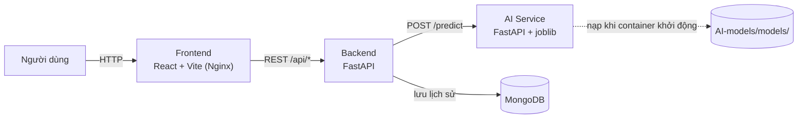
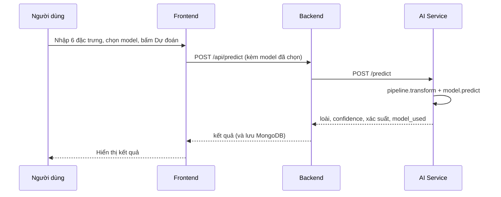

# Penguin Classification — Phân loại loài chim cánh cụt Palmer Archipelago

> Học phần **Học máy cơ bản** · Lớp **12523W.2** · GV: Nguyễn Đức Tuấn Anh · **Nhóm 14**

Ứng dụng web dự đoán loài chim cánh cụt (**Adelie / Chinstrap / Gentoo**) từ 6 đặc trưng đo được. Người dùng **chọn 1 trong 4 model** (Logistic Regression, KNN, SVM, Gradient Boosting) để chạy dự đoán; mỗi kết quả hiển thị loài dự đoán, confidence và xác suất theo từng loài. Giao diện còn có **bảng so sánh Accuracy / Precision / Recall / F1 trên tập test** và đánh dấu model được khuyến nghị.

Toàn bộ hệ thống (Frontend, Backend, AI Service, MongoDB) chạy bằng Docker, khởi động chỉ với một lệnh.

---

## 1. Thành viên

| Họ tên | MSSV | Phần việc |
|---|---|---|
| [Đặng Văn Sỹ] | 12523077 | [VD: EDA, xử lý dữ liệu, SVM, Gradient Boosting, Backend, AI Service] |
| [Đỗ Thanh Mai] | 12523048 | [VD: Logistic Regression, KNN, Frontend, Docker, triển khai] |

> Cả hai thành viên đều nắm được toàn bộ pipeline và cả 4 model.

---

## 2. Bài toán

- **Loại bài toán:** phân loại đa lớp (multiclass classification).
- **Cột mục tiêu:** `species` — 3 lớp `Adelie`, `Chinstrap`, `Gentoo`.
- **Đầu vào (6 đặc trưng):** `culmen_length_mm`, `culmen_depth_mm`, `flipper_length_mm`, `body_mass_g`, `island`, `sex`.
- **Ý nghĩa thực tế:** hỗ trợ nhận diện nhanh loài từ số đo hiện trường, thay cho việc phân loại thủ công.

---

## 3. Dữ liệu

- **Nguồn:** [Palmer Archipelago (Antarctica) Penguin Data — Kaggle](https://www.kaggle.com/datasets/parulpandey/palmer-archipelago-antarctica-penguin-data)
- **Dữ liệu gốc:** Dr. Kristen Gorman và Palmer Station Antarctica LTER · **Giấy phép:** CC0
- **Vị trí trong repo:** `AI-models/data/archive.zip` (đọc trực tiếp từ file zip, **không cần giải nén thủ công**). Mô tả chi tiết cột: xem `AI-models/data/DATA.md`.

| Cột | Kiểu | Ý nghĩa |
|---|---|---|
| `species` | object | Loài (target) |
| `island` | object | Đảo quan sát: `Biscoe`, `Dream`, `Torgersen` |
| `culmen_length_mm` | float | Chiều dài mỏ (mm) |
| `culmen_depth_mm` | float | Độ sâu mỏ (mm) |
| `flipper_length_mm` | int | Chiều dài cánh chèo (mm) |
| `body_mass_g` | int | Khối lượng cơ thể (g) |
| `sex` | object | Giới tính: `MALE`, `FEMALE` |

**Chia dữ liệu:** 80% train / 20% test (`stratify`, `random_state` cố định) — khoảng 273 mẫu train và 69 mẫu test. Tiền xử lý (điền thiếu, One-Hot, chuẩn hóa) nằm trong `sklearn Pipeline`, chỉ `fit` trên tập train để tránh rò rỉ dữ liệu.

Hình EDA (≥5 hình, có giải thích trong báo cáo) nằm ở `docs/figure/`.

---

## 4. Kết quả model

Cả 4 model và baseline dùng **cùng cách chia dữ liệu, cùng pipeline tiền xử lý, cùng metric**. Siêu tham số được tinh chỉnh bằng cross-validation **chỉ trên tập train**; tập test chỉ dùng một lần để lấy kết quả cuối.

### 4.1. Kết quả trên tập test

| Model | Test Acc. | Train Acc. | Gap (train − test) | Precision (macro) | Recall (macro) | F1 (macro) | ROC-AUC (macro) |
|---|---|---|---|---|---|---|---|
| Baseline (Dummy) | 0.4348 | 0.4432 | 0.0084 | 0.1449 | 0.3333 | 0.2020 | 0.5 |
| Logistic Regression | 1.0000 | 1.0000 | 0.0000 | 1.0000 | 1.0000 | 1.0000 | 1.0 |
| KNN | 1.0000 | 1.0000 | 0.0000 | 1.0000 | 1.0000 | 1.0000 | 1.0 |
| SVM | 1.0000 | 0.9927 | 0.0073 | 1.0000 | 1.0000 | 1.0000 | 1.0 |
| Gradient Boosting | 1.0000 | 1.0000 | 0.0000 | 1.0000 | 1.0000 | 1.0000 | 1.0 |

### 4.2. Huấn luyện và chi phí vận hành

| Model | Siêu tham số chọn (GridSearchCV) | CV score (train) | Thời gian train | Thời gian dự đoán / mẫu | Kích thước file |
|---|---|---|---|---|---|
| Logistic Regression | `C=10`, `max_iter=…` | 0.9912 | 2.84 s | 0.131 ms | [..] KB |
| KNN | `metric=manhattan`, … | **0.9957** | 3.28 s | 0.114 ms | [..] KB |
| SVM | `C=0.1`, `gamma=scale`, … | 0.9955 | **1.33 s** | **0.105 ms** | [..] KB |
| Gradient Boosting | `learning_rate=0.05`, … | 0.9838 | 59.50 s | 0.118 ms | [..] KB |

> Điền đủ các tham số còn lại (dấu `…`) từ `best_params` trong notebook, và kích thước file bằng `ls -lh AI-models/models/`.

### 4.3. Nhận xét: model nào tốt, model nào xấu, vì sao

- **So với Baseline:** Baseline (luôn đoán lớp phổ biến nhất) chỉ đạt Accuracy 0.4348 và F1-macro 0.2020, ROC-AUC 0.5 (đúng mức đoán ngẫu nhiên). Cả 4 model đều vượt xa mốc này, nên đặc trưng đầu vào thật sự mang thông tin phân biệt loài.
- **Cả 4 model đạt 1.00 trên tập test — đây không phải dấu hiệu rò rỉ dữ liệu**, vì: (1) Baseline cho kết quả thấp hợp lý nên quy trình đánh giá không bị lỗi; (2) Train Acc. và Test Acc. gần như bằng nhau (gap ≤ 0.0073), không có overfitting; (3) điểm cross-validation trên tập train (0.984–0.996) nhất quán với kết quả test. Nguyên nhân là bộ Palmer Penguins **vốn tách lớp rất tốt** (ví dụ Gentoo khác rõ ở `flipper_length_mm` và `body_mass_g`, Adelie/Chinstrap khác ở `culmen_length_mm`, `culmen_depth_mm` — xem hình EDA).
- **Hạn chế khi đọc kết quả:** tập test chỉ khoảng 69 mẫu nên "1.00" không đủ sức phân biệt các model với nhau. Vì vậy việc chọn model dựa thêm vào điểm cross-validation, thời gian dự đoán, độ ổn định và độ phức tạp.
- **Gradient Boosting:** kém nhất về chi phí — train mất 59.5 s (gấp 18–45 lần các model còn lại) và CV score thấp nhất (0.9838), trong khi không mang lại độ chính xác test cao hơn.
- **KNN:** CV score cao nhất (0.9957) nhưng phải lưu toàn bộ dữ liệu train và thời gian dự đoán tăng theo kích thước dữ liệu.
- **Logistic Regression:** đơn giản, dễ giải thích hệ số, nhưng CV score thấp hơn KNN/SVM một chút (0.9912).
- **SVM:** CV score gần như ngang KNN (0.9955), train nhanh nhất (1.33 s), dự đoán nhanh nhất (0.105 ms); Train Acc. 0.9927 thấp hơn Test Acc. — dấu hiệu mô hình không bị overfit.

### 4.4. Model được chọn

**Logistic Regression** (`best_model` trong `AI-models/models/metadata.json`). 
Vì cả 4 model cùng đạt 1.00 trên tập test, việc chọn dựa vào các tiêu chí phụ:

Không overfitting: Train Acc. = Test Acc. = 1.0000, gap = 0.
Dễ giải thích: hệ số hồi quy cho biết đặc trưng nào (flipper_length_mm, culmen_length_mm, ...) đẩy dự đoán về loài nào — thuận lợi khi giải thích trước hội đồng, khác với Gradient Boosting hay SVM kernel là "hộp đen" hơn.
Xác suất đầu ra tự nhiên: Logistic Regression cho xác suất theo từng loài trực tiếp từ hàm softmax, phù hợp với phần hiển thị confidence và xác suất trên giao diện.
Nhẹ và nhanh: train 2.84 s, dự đoán 0.131 ms/mẫu, file model rất nhỏ, không phải lưu dữ liệu train như KNN.
Ổn định: CV score 0.9912 sát kết quả test, cho thấy mô hình khái quát tốt.

Đánh đổi cần nói rõ: về điểm CV, Logistic Regression (0.9912) thấp hơn KNN (0.9957) và SVM (0.9955) khoảng 0.004. Với dữ liệu chỉ ~340 mẫu và tập test ~69 mẫu, chênh lệch này nhỏ và chưa đủ để kết luận model nào thực sự vượt trội; SVM nhỉnh hơn về tốc độ (0.105 ms so với 0.131 ms) nhưng khác biệt không đáng kể với hệ thống này. Nhóm ưu tiên tính đơn giản, khả năng giải thích và xác suất đầu ra thay vì chênh lệch rất nhỏ về CV.

Giao diện mặc định chọn sẵn Logistic Regression và gắn nhãn ★; người dùng vẫn có thể chuyển sang model khác để so sánh.

---

## 5. Đóng gói model

Toàn bộ model nằm trong `AI-models/models/`:

```
AI-models/models/
├── models_bundle.joblib   # dict {tên model: sklearn Pipeline (tiền xử lý + model)}
├── metadata.json          # thông tin từng model: metric, version, ngày train, best_model
└── schema.json            # tên cột, kiểu dữ liệu, cột mục tiêu
```

- Mỗi model được lưu **cùng pipeline tiền xử lý** (`ColumnTransformer` + estimator) nên bước tiền xử lý lúc dự đoán **giống hệt** lúc huấn luyện.
- **Cách export từ Colab:**
  ```python
  import joblib
  joblib.dump(
      {"Baseline": pipe_base, "LogisticRegression": pipe_lr, "KNN": pipe_knn,
       "SVM": pipe_svm, "GradientBoosting": pipe_gb},
      "models_bundle.joblib",
  )
  ```
  Sau đó tải file về, đặt vào `AI-models/models/`, cập nhật `metadata.json` (metric từng model, `best_model`) rồi commit.
- **Thêm model mới không ảnh hưởng model cũ:** trong `metadata.json` khai báo `"source": "bundle"` (nằm trong file bundle) hoặc `"source": "file"` (một file `.joblib` riêng). Model nào thiếu file sẽ bị bỏ qua và ẩn khỏi danh sách chọn, **không làm AI Service dừng**.
- **Phiên bản thư viện (phải khớp giữa Colab và Docker):** `scikit-learn==1.6.1`, `pandas==2.2.3`, `numpy==2.1.3` (ghim trong `AI-models/service/requirements.txt`). Trong Colab in `sklearn.__version__` để đối chiếu trước khi export.

---

## 6. Kiến trúc hệ thống





### API chính

| Service | Endpoint | Chức năng |
|---|---|---|
| Backend | `POST /api/predict` | Dự đoán; body gồm 6 đặc trưng + `model` (tùy chọn, mặc định là best model) |
| Backend | `GET /api/models` | Danh sách model + metric + model khuyến nghị |
| Backend | `GET /api/model-info` | Thông tin model, schema |
| Backend | `GET /api/history` | Lịch sử dự đoán (MongoDB) |
| Backend | `GET /health`, `GET /api/health` | Trạng thái backend, AI Service, MongoDB |
| AI Service | `POST /predict` | Chạy model được chọn |
| AI Service | `GET /models`, `GET /model-info`, `GET /health` | Danh sách model, thông tin, trạng thái |

Tài liệu API tự sinh (Swagger): `http://localhost:8000/docs`.

### Cấu trúc thư mục

```
14_12523077_12523048_PenguinClassification/
├── App/
│   ├── Frontend/          # React + Vite, Dockerfile (Nginx)
│   └── Backend/           # FastAPI, Dockerfile
├── AI-models/
│   ├── Colab/             # Notebook: EDA, tiền xử lý, huấn luyện, đánh giá
│   ├── src/               # File xử lý .py đi kèm
│   ├── data/              # archive.zip + DATA.md
│   ├── models/            # models_bundle.joblib, metadata.json, schema.json
│   ├── service/           # AI Service (FastAPI), Dockerfile
│   └── requirements.txt
├── docs/                  # BaoCao.docx, slide.pptx, figure/ (hình EDA)
├── docker-compose.yml
├── .env.example
├── .gitignore
└── README.md
```

---

## 7. Chạy trên máy

**Yêu cầu:** chỉ cần cài [Docker](https://docs.docker.com/get-docker/) (kèm Docker Compose).

```bash
cp .env.example .env
docker compose up --build
```

| Thành phần | Địa chỉ |
|---|---|
| Frontend | http://localhost:5173 |
| Backend API (Swagger) | http://localhost:8000/docs |
| AI Service | http://localhost:8001/health |
| MongoDB | localhost:27017 |

Dừng hệ thống: `docker compose down` (thêm `-v` để xóa cả dữ liệu MongoDB).

**Kiểm tra trạng thái và log:**

```bash
docker compose ps                    # trạng thái từng container/port
curl http://localhost:8001/health    # AI Service: models_loaded, models_missing, best_model
curl http://localhost:8000/health    # Backend: trạng thái AI Service và MongoDB
docker compose logs -f backend       # log theo thời gian thực (thay bằng ai-service, frontend)
```

Model được **nạp ngay khi container AI Service khởi động** (không đợi request đầu tiên).

---

## 8. Huấn luyện lại model

1. Mở các notebook trong `AI-models/Colab/` trên Google Colab.
2. Chạy theo thứ tự: **EDA → tiền xử lý → huấn luyện → đánh giá** (Runtime → *Restart & Run All*). Notebook đọc dữ liệu từ `AI-models/data/archive.zip`.
3. Export model theo hướng dẫn ở [mục 5](#5-đóng-gói-model), cập nhật `metadata.json`.
4. Chạy lại `docker compose up --build` để AI Service nạp model mới.

Link Colab: 
01_eda: `[https://colab.research.google.com/drive/1ItutQ1AZQoggRGGAYA_4IvM-kVyD-phY?usp=sharing]`
02_preprocess: `[https://colab.research.google.com/drive/1rOLXlfw8YFA6IWkPJZFDzlJ8tO51QBKN?usp=sharing]`
03_train `[https://colab.research.google.com/drive/14xcCbBoExy7IG3OOwKUiu10Y9uFN3CeJ?usp=sharing]`
04_evaluate: `[https://colab.research.google.com/drive/1xX3EinDNGNaw1LHwfdaIhO0rfqOB_-Lc?usp=sharing]`
---

## 9. Biến môi trường

Sao chép `.env.example` thành `.env` (file `.env` **không được commit**).

| Biến | Ý nghĩa | Giá trị mặc định (chạy local) |
|---|---|---|
| `VITE_API_URL` | Địa chỉ Backend mà Frontend gọi (được nhúng lúc build) | `http://localhost:8000` |
| `AI_SERVICE_URL` | Địa chỉ AI Service mà Backend gọi | `http://ai-service:8000` |
| `MONGO_URL` | Chuỗi kết nối MongoDB | `mongodb://mongodb:27017` |
| `MONGO_DB` | Tên database | `penguin_app` |

> Khi chạy local, các service gọi nhau bằng **tên service trong Docker network**, không dùng `localhost`. Khi public, chỉ cần đổi các giá trị trong `.env` sang địa chỉ deploy/tunnel (Frontend phải build lại vì `VITE_API_URL` được nhúng lúc build).

---

## 10. Triển khai

Hệ thống public theo một trong hai cách:

- **Cloud:** Frontend → Vercel; Backend và AI Service → Render (Web Service dạng Docker); MongoDB → MongoDB Atlas (gói miễn phí).
- **Máy cá nhân/Colab + tunnel:** chạy `docker compose up --build`, public bằng ngrok (hoặc tương đương), rồi cập nhật `.env`.

**Các bước khi đổi địa chỉ public:**

1. Cập nhật `VITE_API_URL` / `AI_SERVICE_URL` trong `.env`.
2. Build lại và khởi động: `docker compose up --build -d`.
3. Kiểm tra luồng FE → BE → AI → FE trên **địa chỉ thật**.
4. Ghi vào [Nhật ký đổi cổng/tunnel](#12-nhật-ký-đổi-cổngtunnel) và cập nhật [Demo online](#11-demo-online), rồi push lên Git.

> Nếu dùng tunnel không có IP tĩnh, link được cập nhật lại **vào sáng thứ Hai hàng tuần** cho đến ngày bảo vệ.

**Lưu ý:** dịch vụ miễn phí có thể "ngủ" khi lâu không truy cập — cần truy cập trước để "làm nóng" hệ thống.

---

## 11. Demo online

> Cập nhật lần cuối: `[dd/mm/yyyy hh:mm]`

| Thành phần | Địa chỉ |
|---|---|
| Ứng dụng (Frontend) | `[https://penguin-classification.vercel.app/` |
| Backend API (Swagger) | `http://127.0.0.1:8000/docs` |
| AI Service (health) | `http://127.0.0.1:8001//health` |

---

## 12. Nhật ký đổi cổng/tunnel

| Thời điểm | Địa chỉ cũ | Địa chỉ mới | Ghi chú |
|---|---|---|---|
| `[dd/mm/yyyy hh:mm]` | — | `[link]` | Khởi tạo |

---

## 13. Kết quả kiểm thử hiệu năng

| Chỉ số | Kết quả | Mục tiêu |
|---|---|---|
| Số người dùng đồng thời / thời lượng | `[..]` / `[..]` | 10–20 người, 1 phút |
| Request/giây | `[..]` | — |
| Thời gian phản hồi p50 / p95 (`/api/predict`) | `[..]` / `[..]` | p95 < 2 giây |
| Tỉ lệ lỗi | `[..]` | < 1% |
| Ngưỡng chịu tải | `[..]` | — |

Công cụ: `[k6 / Locust / Apache Bench]` · Kiểm thử chức năng: `pytest` cho AI Service và Backend.

> Thời gian dự đoán ở mục 4.2 (~0.1 ms/mẫu) chỉ đo riêng model trong notebook; thời gian phản hồi thực của `/api/predict` còn gồm mạng, Backend và MongoDB nên sẽ cao hơn.

---

## 14. Hạn chế và hướng phát triển

**Hạn chế**
- Dataset nhỏ (khoảng 340 mẫu), tập test chỉ khoảng 69 mẫu: cả 4 model cùng đạt 1.00 nên tập test không đủ sức phân biệt chất lượng các model; kết quả có thể thay đổi khi chia dữ liệu khác.
- Bộ dữ liệu tách lớp quá tốt nên bài toán khá dễ; kết quả chưa chắc phản ánh hiệu năng trên dữ liệu thực địa nhiều nhiễu hơn.
- `[Bổ sung các hạn chế thực tế của nhóm: tunnel không ổn định, chưa load test đủ lớn, ...]`

**Hướng phát triển**
- Đánh giá bằng cross-validation lặp (repeated / stratified k-fold) và báo cáo độ lệch chuẩn để so sánh model công bằng hơn.
- Thử thêm dữ liệu khó hơn hoặc thêm họ model (Random Forest, XGBoost).
- Tự động hóa việc cập nhật `best_model` từ pipeline đánh giá.
- Thêm CI (GitHub Actions) chạy `docker compose build` và test cho mỗi lần push.
- Giám sát model theo thời gian (model monitoring).

---

## Tài liệu tham khảo

- Dataset: [Kaggle — Palmer Archipelago Penguin Data](https://www.kaggle.com/datasets/parulpandey/palmer-archipelago-antarctica-penguin-data)
- [scikit-learn](https://scikit-learn.org) · [FastAPI](https://fastapi.tiangolo.com) · [Docker](https://docs.docker.com) · [ngrok](https://ngrok.com/docs) · [Render](https://render.com/docs) · [Vercel](https://vercel.com/docs) · [MongoDB Atlas](https://www.mongodb.com/atlas)